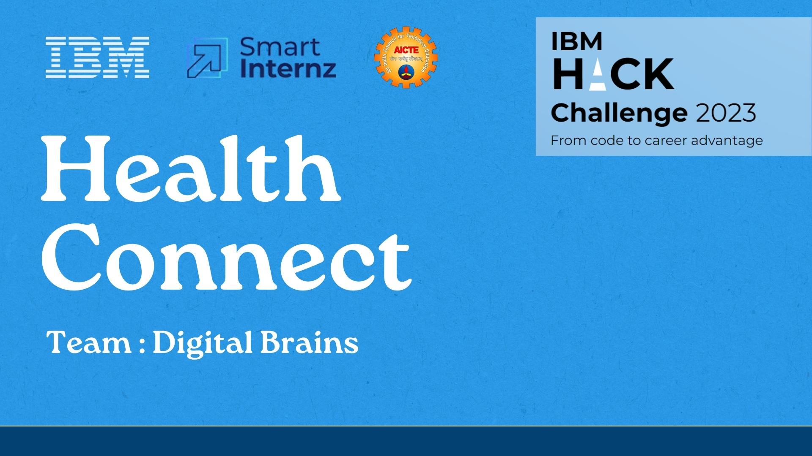

# Health Connect

HealthConnect is a cloud-based healthcare management platform that aims to improve the coordination of care by connecting patients, providers, and health records onto an integrated system for streamlined appointment scheduling, health record access, e-prescriptions, analytics, and enhanced patient engagement.

Deployment Link: Press Here (https://healthconnect-2002sais-dev.apps.sandbox-m3.1530.p1.openshiftapps.com/)

# Key Value Proposition

1) **Improved Care Coordination**: By consolidating medical records, appointments, prescriptions, and care workflows onto a unified platform, HealthConnect significantly improves care coordination and continuity. This reduces medical errors and duplication of services.

2) **Enhanced Patient Experience**: The solution provides convenience to patients for activities like appointment booking, accessing test results, refilling prescriptions, etc. The user-friendly interface aims to make healthcare interactions more engaging and efficient.

3) **Operational Efficiencies**: Features like appointment scheduling, notifications, and digitized prescriptions help optimize administrative tasks and staff time for healthcare organizations. Analytics provide data-driven insights on service levels and resource allocation.

4) **Accessibility**: The platform expands access to healthcare services by simplifying appointment scheduling and enabling telemedicine capabilities. This makes healthcare more equitable.
Medication Adherence: ePrescriptions and reminder alerts help patients better comply with medication plans leading to improved health outcomes.

5) **Population Health Analytics**: Aggregated health data facilitates analysis of public health KPIs, disease surveillance, treatment effectiveness, costs, and social determinants that can inform policy decisions.

6) **Blogs and Articles**: The platform incorporates health blogs and articles to promote patient education on wellness topics, diseases, medications, lifestyle changes, diet, and more.

7) **Streak Counters and Milestones**: The app tracks consecutive days/weeks users have logged an activity like exercise or meditation. Prominent counters display current streaks. Badges are awarded when users achieve streak milestones like 7, 15, 30, or 90-day streaks. Longer streaks earn more prestigious badges. Seeing their progress reflected through growing streak counters and achieving streak milestones helps motivate users to maintain consistency.

8) **Security**: State-of-the-art data security mechanisms help maintain patient privacy and demonstrate compliance with healthcare regulations. This builds trust.
# Problem Statement

The healthcare industry today is plagued by fragmentation across systems and lack of coordination leading to broken patient journeys. Patients struggle to schedule appointments, access records scattered across providers, and manage medications. This results in poor continuity of care. Studies show lack of coordination contributes to over 130 million medical errors and nearly half of hospital readmissions annually, costing billions.

There is a need for an integrated cloud platform that connects patients, providers, and records to improve continuity and care coordination. The proposed "HealthConnect" solution aims to address these systemic coordination challenges by developing a centralized healthcare platform. It consolidates appointments, records, prescriptions, and workflows to deliver unified patient experiences. The latest technologies like cloud computing, microservices, and advanced analytics will be leveraged to transform fragmented journeys into seamless, engaging ones.

# Proposed Solution

HealthConnect is a cloud-based healthcare management platform that aims to improve coordination and continuity of care by integrating key workflows and health data into a centralized system.

The core capabilities offered by HealthConnect include:

1) **Appointment Scheduling**: Enables patients to easily search, book, reschedule, and manage appointments across healthcare providers.

2) **Health Records Management**: Creates longitudinal health records for patients by consolidating documents from across providers into a unified portal.

3) **ePrescribing**: Digitizes and streamlines the prescription workflow from ordering to fulfillment.

4) **Care Team Coordination**: Provides care providers a consolidated overview of patient cases to improve collaboration.

5) **Patient Engagement Portals**: Offers patients self-service access to health records, appointments, prescription refills, and doctor communication.

6) **Population Health Analytics**: Gains insights from aggregated health data to understand disease trends, outcomes, and costs.

Additionally, HealthConnect is envisioned to evolve into an open protocol akin to [**ONDC**](https://ondc.org/ "Open Network for Digital Commerce") for decentralized health data exchange through an **Open Health Data Network (OHDN)**. The OHDN will allow different healthcare providers to share interoperable health records on the network with patient consent.

Patients will get unique Health IDs for identifier portability. Granular consent protocols will enable patients to authorize access to their data. Blockchain approaches can secure health data provenance.

By decentralizing control while federating health data exchange, OHDN built on top of HealthConnect can rapidly advance nationwide digitization and interoperability in healthcare.

The solution utilizes a microservices architecture on cloud infrastructure for modularity, scalability, and reliability. Security mechanisms safeguard data privacy. Interoperability is enabled through FHIR-compliant APIs.

By comprehensively addressing coordination gaps and pioneering decentralized health data exchange through OHDN, HealthConnect aims to deliver the next generation of integrated healthcare experiences.

# END-TO-END PLATFORM WORKFLOW (Core Functionality)


- The workflow illustrates the typical patient journey and interactions on the HealthConnect platform, from appointment scheduling to maintaining health records.

- Patients can search for and select a suitable doctor based on preferences like location, specialty, accepted insurance, etc.

- Appointment slots can be booked by checking availability on the doctor's calendar and selecting a convenient time.

- Platform notifications and reminders reduce missed appointments and ensure better follow-ups.

- After an appointment, any new lab reports, discharge summaries, or prescription orders can be digitized and uploaded to the patient's health records.

- Previously uploaded health reports, immunization history, allergies, etc. can also be viewed by the patient.

- Doctors are able to access patient records, previous diagnoses, and medical history with appropriate consent to provide improved continuity of care.

- Patients have full control over their medical information. They can grant access to specific reports or providers as needed.

- The workflow covers the typical end-to-end interactions with the platform spanning appointment booking, doctor visits, new report uploads, and health record access.

- It provides a high-level overview of how patients and providers would leverage the capabilities of HealthConnect in a typical usage scenario.

# SECURE HEALTH RECORD STORAGE (Data Protection Methodology)


- The platform uses public-private key encryption to securely store health records in the cloud.

- Each user has a unique public & private key that is stored in the database.

- The private key is used for digitally signing the health records uploaded by the user.

- The public key is used by the system to verify the signature and validate that the record originated from a valid user.

- When a user uploads a health record on the HealthConnect platform, the following security measures are implemented:
  1. The user's application digitally signs the PDF document using the patient's private key stored locally on the device. This private key signature validates the record's origin.
  
  2. The contents of the PDF are hashed using a cryptographic hashing algorithm like SHA-256. This hash value represents a unique fingerprint of the document.
  
  3. Metadata like timestamp, device ID, etc. are also signed along with the document hash and appended to the record.
  
  4. The complete health record, including the original PDF, calculated hash, and signed metadata is stored in the database.
  
  5. The signature, hashing, and metadata provide tamper-evident capabilities. Any change to the record would break the signature verification or cause the hash to mismatch.
  
  6. By signing with the patient's private key, hashing the file contents, and appending authenticated metadata, the platform ensures each health record upload is fully verifiable, tamper-proof, and tied unambiguously to the submitting user.

- The records are encrypted before storage for data privacy.

- The system uses industry-standard asymmetric encryption algorithms like RSA or ECC for robust security.

# BLOCKCHAIN-INSPIRED SECURITY FOR AUDIT TRAILS


- The platform maintains a centralized append-only audit log of all health record transactions.

- Each transaction is recorded with metadata like timestamp, user ID, access type, etc.

- New entries are immutably appended to the log in an ordered sequence.

- The audit log provides a verifiable history of all record events - uploads, access, and modifications.

- Tampering the logs can be detected as it would break the sequenced record hashes.

- Regulators can verify if unauthorized alterations were made by auditing the logs.

- Patients can view the logs to see how their records have been accessed.

- The centralized structured log maintains a timeline of all health record transactions.

- While not a decentralized blockchain, it provides transparency and tamper-proof audit trails.


## Tech Stack

This section provides insight into the frontend, backend, database, containerization, cloud infrastructure, and security aspects of the project.

**Frontend Technologies**: The front end of HealthConnect is built using a combination of standard web development technologies, ensuring a user-friendly and responsive interface.
- HTML: Provides the foundational structure of the user interfaces.
- CSS: Handles visual styling, including colors, fonts, and layouts.
- JavaScript: Empowers dynamic behavior and AJAX functionality, enhancing interactivity.
- Cross-Device Accessibility: The combination of these technologies results in intuitive and responsive apps accessible across various devices.

**Backend Technologies**: The backend system of HealthConnect is constructed using robust technologies that facilitate seamless data processing and interaction.
- Python Programming Language: Chosen for its versatile ecosystem, ranging from web APIs to machine learning and NLP.
- Flask Web Framework: Offers a lightweight yet efficient framework for rapid API development.
- Integration of External APIs: Google Calendar and Fitness APIs are integrated using Python libraries for appointment reminders and fitness data integration.

**Database Technology**: HealthConnect's core database is powered by MongoDB, a NoSQL database that accommodates diverse healthcare data scenarios.

- Document-Oriented Structure: MongoDB's flexibility suits the variability of healthcare data across patients and care contexts.
- Redis: Redis is utilized to manage tokens and store OTPs for a fixed duration, ensuring fast access and expiration handling.

**Containerization**: Docker containers are employed to streamline deployment and enhance component isolation.

- Microservices Packaging: Docker containers package microservices and applications, simplifying deployment.
- Isolated Environments: Containers provide isolated environments for each component, improving portability across different stages of development.

**Cloud Infrastructure**: Cloud technology contributes to scalable and accessible storage solutions.

- IBM Cloud Object Storage: Used for storing large medical files like images and PDFs.
- Scalability Benefits: Cloud infrastructure enhances scalability to accommodate growing data needs.

**Security Measures**: Comprehensive security mechanisms are implemented throughout the platform to ensure data privacy and compliance.

- Encryption: Sensitive data is encrypted to safeguard confidentiality.
- Access Controls: Mechanisms are in place to regulate and manage user access.
- Activity Auditing: Logging and auditing ensure accountability.

## Application Demo

<a href="https://pranavtej.github.io/destination-changer/" target="_blank">
    
</a>


## Environment Variables

To run this project, you will need to add the following environment variables to your confidential.py file

`MONGOURI`: A connection address for MongoDB, which is a type of database. You get this when setting up MongoDB.

`IBM_ENDPOINT`: The web address for an IBM service. You create an account with IBM and get this when using their services.

`IBM_API_KEY_ID`: An ID for accessing IBM services. You make this key in your IBM Cloud account.

`IBM_INSTANCE_CRN`: A special name for resources in IBM Cloud. You find it in your IBM Cloud settings.

`IBM_ACCESS_KEY_ID` - `IBM_SECRET_ACCESS_KEY`: Keys for using IBM Cloud services, like storage. You generate these in IBM Cloud's security settings.

`REDIS_URI` - `REDIS_HOST` - `REDIS_PADDWORD`: Details for connecting to a Redis database. You get these from your Redis provider or your own setup.

`OPEN_AI_KEY`: An API key for the OpenAI service. You create it when you sign up for OpenAI and find it in your developer settings.

Remember to keep these keys and addresses secure and don't share them publicly to protect your services and data.


## Run Locally

Clone the project

```bash
  git clone https://link-to-project
```

1. Using docker

```bash
  docker build -t healthConnect .
  docker run -p 5000:5000 healthConnect
```

2. Using Virtual Environment

- Create a virtual environment

```bash
  virtualenv healthConnect
```

- Activate the virtual environment

```bash
  healthConnect\Scripts\activate.ps1
```

- Install dependencies

```bash
  pip install -r requirements.txt
```

- Run the application

```bash
  flask run
```
